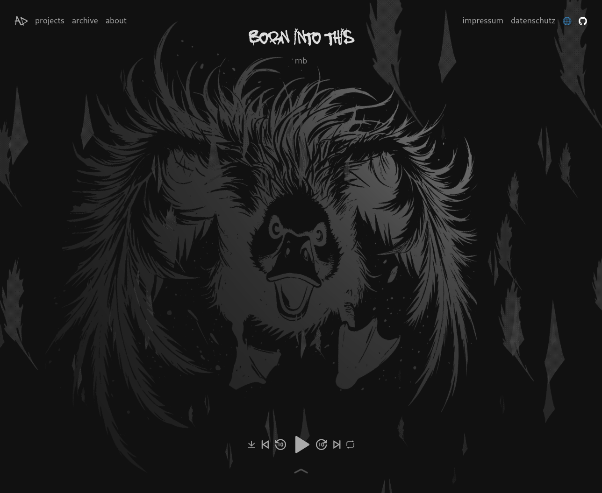
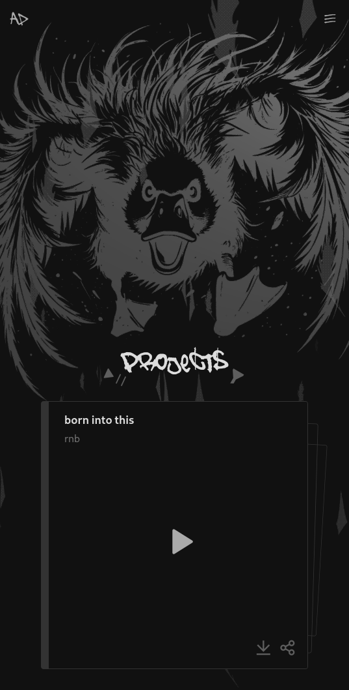

# batakali

This is a website for sharing music with the world, integrating smooth 3D animations to create an interactive experience keeping the user active and interested.

## 🌐 Technical Details

The website leverages cutting-edge tools and libraries for both functionality and design.

### Built With:

- **React**
- **Vite**
- **three.js**

### Special Thanks

A huge shoutout to the [Poimandres](https://pmnd.rs/) developer collective for providing these fantastic libraries:

- [@react-three/fiber](https://www.npmjs.com/package/@react-three/fiber): A React renderer for three.js.
- [@react-spring](https://www.npmjs.com/package/@react-spring/web): Smooth animations for both web and 3D environments.
- [zustand](https://www.npmjs.com/package/zustand): Simplified state management.

## 🎶 About the Music

Through this website, I share my music with the world. Making music is primarily a hobby for me, so everything is free of charge.

### Terms of Use

The only condition is that you mention me in your releases on Instagram, either in a **post, reel, or comment**.

### What You Can Do:

- Listen to my projects
- Play them (publicly and privately)
- Remix them
- Sample them
- Share them unchanged or with modifications

**Enjoy and have fun!**
